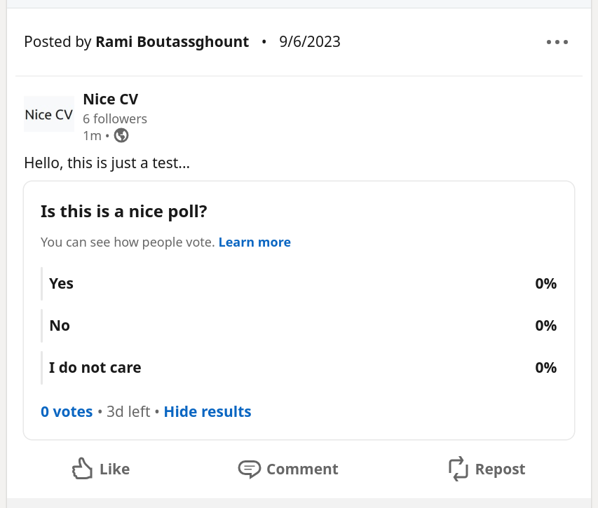

# Linkedin Posts

Utility to share Linkedin posts using the Linkedin Marketing API

Made easy to use in Python.


## Example

Here is a small example using the `share_poll` function.
```python
from linkedin_posts.polls import share_poll

response = share_poll(
  "<HERE YOUR ACCESS TOKEN>",
  comment="Hello, this is just a test...",
  poll_question="Is this is a nice poll?",
  poll_options=["Yes", "No", "I do not care"],
  author_type="organization",
  author_id="71513925",
)

```

[](https://www.linkedin.com/company/nice-cv/)


## Need more?

[📚 Check out the docs 📚](https://linkedin-posts.ramiboutas.com)


