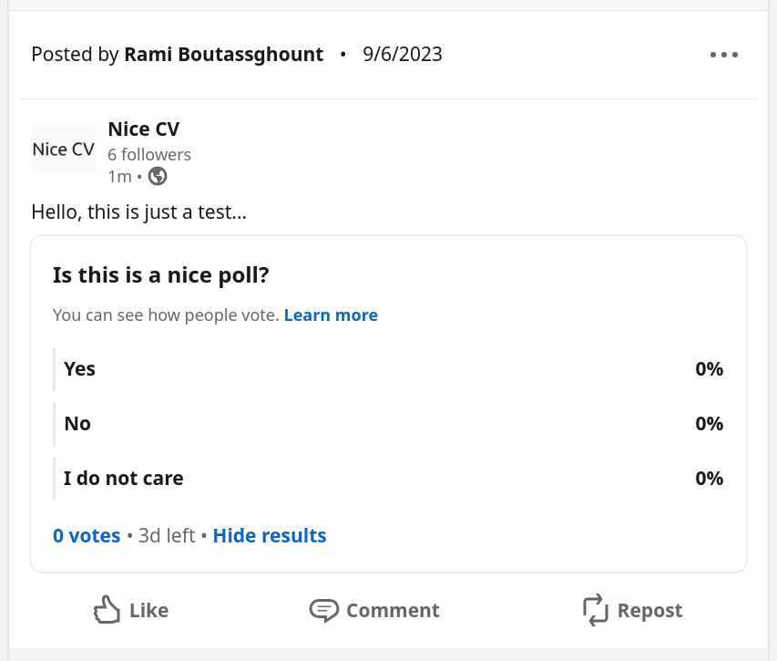

Usage
=====

Share a post
--------------

By the time I am writing this sentence, this is the most useful function of this package.

Share a post in by using the function `share_post` with some arguments.

.. code-block:: python

  from linkedin_posts.posts import share_post

  response = share_post(
    "<HERE YOUR ACCESS TOKEN>",
    comment="publishing a post",
    author_type="organization",
    author_id="71513925",
  )

  # Do something with your response object r (http.client.HttpResponse)
  # Interesting parameters to check:
  # response.getheader("x-restli-id") will return the Linkedin Post ID
  # response.code will return 201 if request proccessed correctly
  ...

Delete a post
---------------

Deleting a post is very straightforward.

Just just need the access token and pass the Linkedin Post ID.

.. code-block:: python

  from linkedin_posts.posts import delete_post

  response = delete_post("<HERE YOUR ACCESS TOKEN>", "urn:li:share:7104319981684674560")

  # response.code will return 204 if request proccessed correctly

Create a poll post
------------------

It it possible to share a post with a poll by using the following code:

.. code-block:: python

  from linkedin_posts.polls import share_poll

  response = share_poll(
    "<HERE YOUR ACCESS TOKEN>",
    comment="Hello, this is just a test...",
    poll_question="Is this is a nice poll?",
    poll_options=["Yes", "No", "I do not care"],
    author_type="organization",
    author_id="71513925",
  )

  # do something with response if you need to!

Now go to your `Linkedin page <https://www.linkedin.com/company/nice-cv/>`_  and check your published poll!

Post with media
---------------

In order to create an post with a nice picture you can use this code.

.. code-block:: python

  # upload a image
  upload_request, image_urn = upload_image(
      "<HERE YOUR ACCESS TOKEN>",
      file="docs/img/nicecv.jpg",
      author_type=author_type,
      author_id=author_id,
  )

  # create a post with the uploaded image
  request = share_post_with_media(
      "<HERE YOUR ACCESS TOKEN>",
      comment="Do you like this nice cv?",
      author_type=author_type,
      author_id=author_id,
      media_id=image_urn
  )

And voilà.

Here is your posts!

